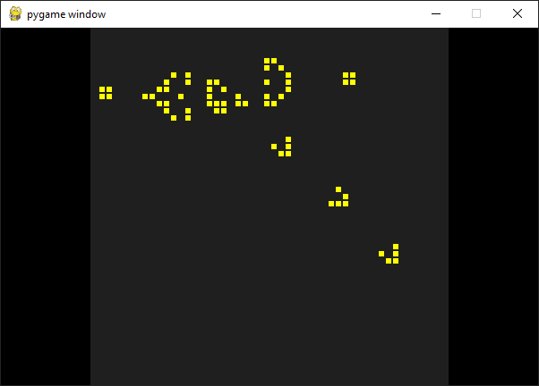

# Game of Life Emulator

An experiment in game emulation through machine learning. The goal was to emulate a game using a machine learning model in the simplest way possible.

At each time step, the state of the game grid is fed into a "cell predictor" which predicts the new state of the grid. The game grid is then updated to this new state.

The cell predictor can be configured to be either a hard-coded one which explicitly follows the usual Game of Life rules, or a machine learning-based one which draws its predictions from an ML model. By default, the ML-based predictor is used.

# Running the game

Ensure you have Python (3.10) installed and a virtual environment created and activated. Install dependencies with:

> pip install -r requirements.txt

You can run the game with:

> python pygame_life.py

## Switching to rule-based prediction

In `pygame_life.py`, you can change the line

> `cell_predictor = get_cell_predictor("model")`

to

> `cell_predictor = get_cell_predictor("explicit")`

and this will use the explicit rule-based cell predictor.

# Retraining the model

The ML model is a fully-convolutional neural network trained using `train_cell_predictor.ipynb`. The model weights are in `model_weights.pth`. You can run the notebook to see the model training and evaluation process.

The notebooks prefixed with `experiment_XX` were experiments used to improve this process.

# Acknowledgements

The original inspiration for this can be traced back to Ollin Boer Bohan's blog post here: https://madebyoll.in/posts/game_emulation_via_dnn/

The core of the game was adapted from Matheus Gomes's pygame-life: https://github.com/matheusgomes28/pygame-life
